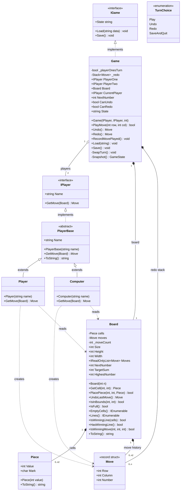
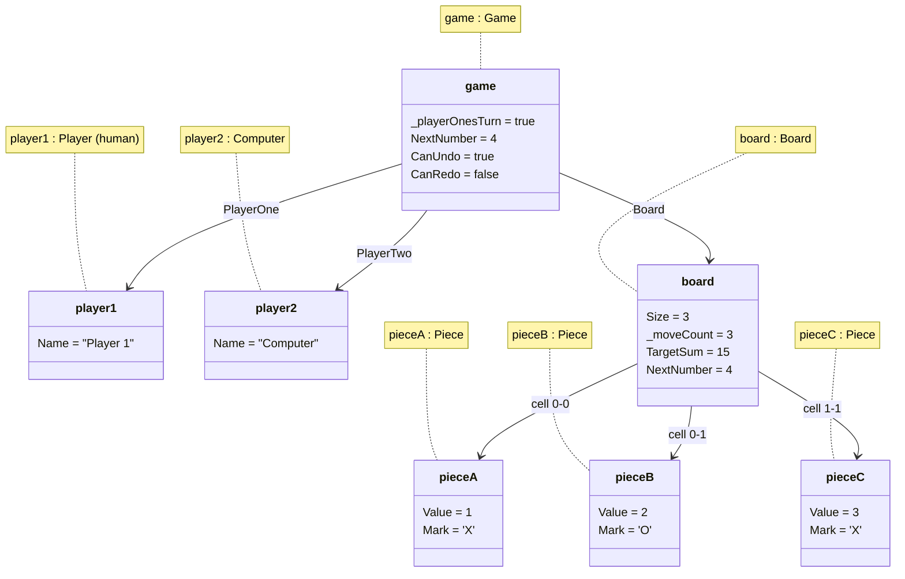
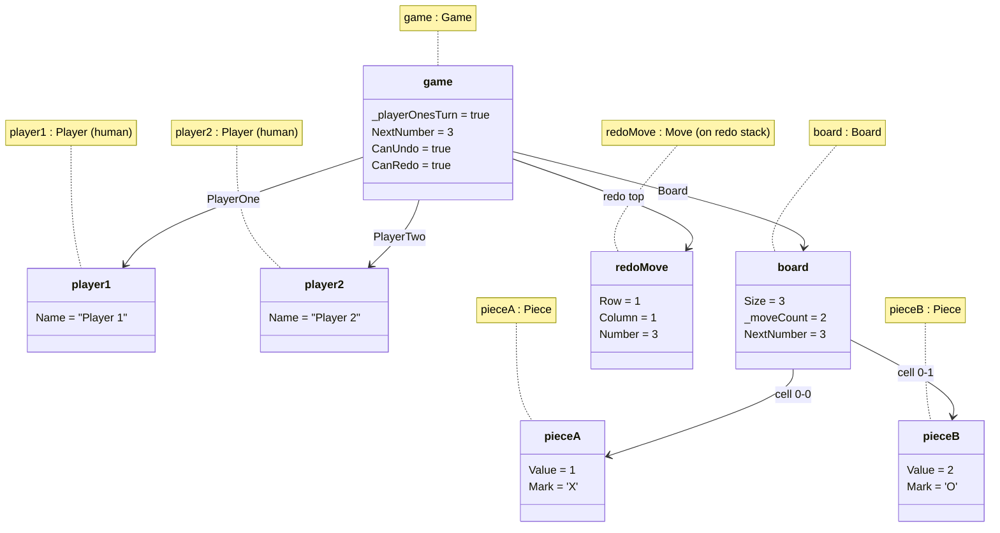
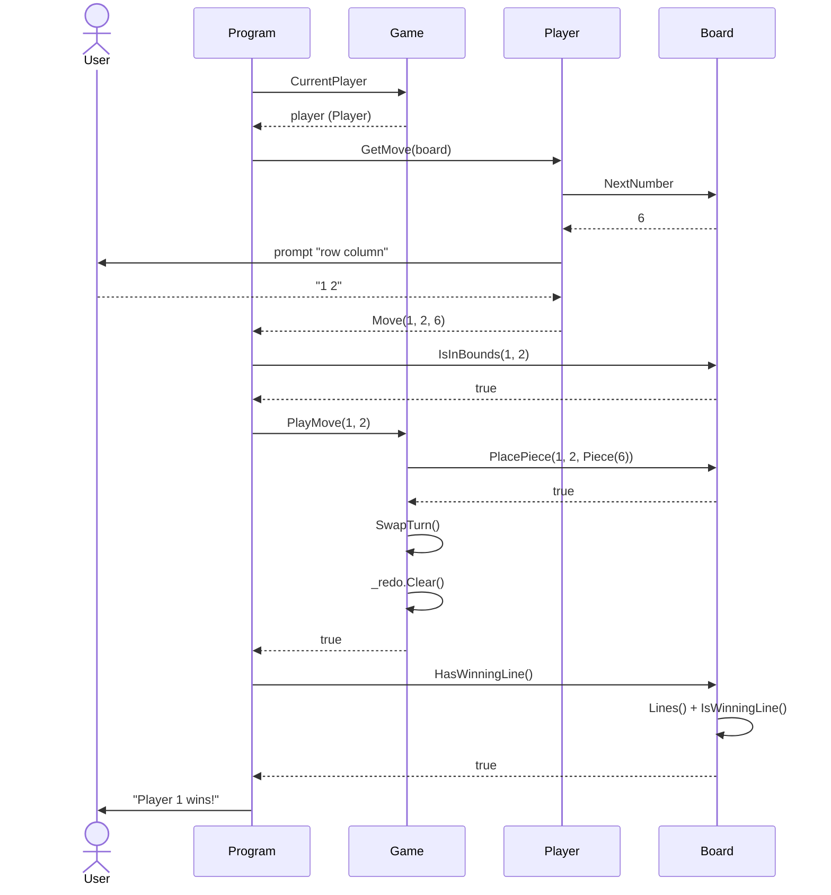
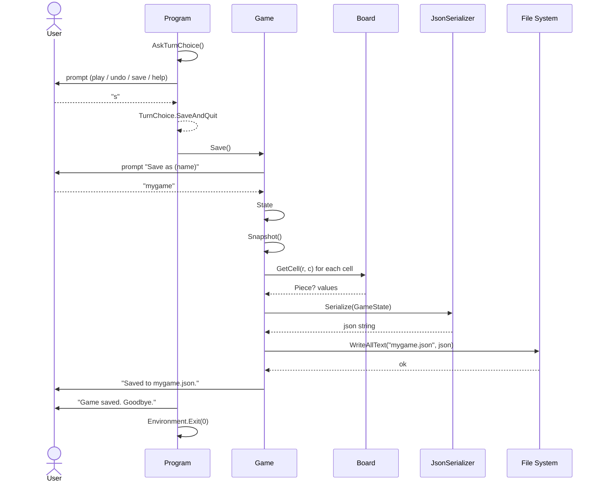

# Numerical Tic Tac Toe — Design Document

This document presents the object-oriented design of the Numerical Tic Tac Toe
console application: a CRC analysis of every class, a class diagram of the whole
software, two object diagrams capturing meaningful runtime snapshots, and two
sequence diagrams of significant execution scenarios.

## 1. Overview of the Domain

Numerical Tic Tac Toe is played on an *n × n* board using the numbers 1..*n²*.
The two players **share** the numbers and play them in order — the 1st move
places 1, the 2nd places 2, and so on — taking turns to drop the next number
into any empty cell. A player wins by completing a row, column or diagonal of
*n* cells whose numbers add up to the *magic constant* `n(n² + 1) / 2` (15 on a
3 × 3 board), regardless of who played the other numbers in that line. Player
one's moves are shown as **X**, player two's as **O** (odd-numbered moves are X,
even-numbered are O).

The application supports a human-vs-human or human-vs-computer game, saving and
loading games as JSON, and undo/redo of moves.

---

## 2. CRC Analysis

Each Class–Responsibility–Collaborator card lists what a class knows and does,
and which other classes it relies on.

### CRC Card: `Game`

| **Class: Game** (implements `IGame`) | |
|---|---|
| **Responsibilities** | **Collaborators** |
| Hold the two players and the board | `IPlayer` |
| Track whose turn it is (state, not derived) and swap it | `Board` |
| Provide the next number to play (`NextNumber`) | `Piece` |
| Play a move: place the piece, swap the turn, clear redo | `Move` |
| Undo / redo moves, maintaining a redo stack | |
| Serialise the whole game to JSON (`State`) | |
| Restore a game from JSON (`Load`) | |
| Save the game to a `.json` file (`Save`) | |

### CRC Card: `Board`

| **Class: Board** | |
|---|---|
| **Responsibilities** | **Collaborators** |
| Hold the *n × n* grid of cells (each a `Piece` or empty) | `Piece` |
| Record the ordered history of moves | `Move` |
| Place a piece; take the last move back (undo) | |
| Report the next number, empty cells, fullness, bounds | |
| Own the winning algorithm (lines, target sum, win test) | |
| Detect whether a trial move would win (`IsWinningMove`) | |
| Render itself as text using each player's X / O mark | |

### CRC Card: `Piece`

| **Class: Piece** | |
|---|---|
| **Responsibilities** | **Collaborators** |
| Hold the number played in a cell (`Value`) | *(none)* |
| Derive the player's mark: X (odd value) or O (even value) | |
| Render as its X / O mark | |

### CRC Card: `Move`

| **Struct: Move** (`readonly record struct`) | |
|---|---|
| **Responsibilities** | **Collaborators** |
| Hold a single move: its `Row`, `Column`, and `Number` | *(none)* |

### CRC Card: `IPlayer`

| **Interface: IPlayer** | |
|---|---|
| **Responsibilities** | **Collaborators** |
| Define what every player exposes: a `Name` | `Board` |
| Define how a player chooses a move (`GetMove`) | `Move` |

### CRC Card: `PlayerBase`

| **Abstract Class: PlayerBase** | |
|---|---|
| **Responsibilities** | **Collaborators** |
| Hold state common to all players — the `Name` | `Board` |
| Declare the abstract move-selection strategy (`GetMove`) | `Move` |

### CRC Card: `Player`

| **Class: Player** (extends `PlayerBase`, implements `IPlayer`) | |
|---|---|
| **Responsibilities** | **Collaborators** |
| Represent a human player | `Board` |
| Prompt at the console for a cell ("row column") | `Move` |
| Return the chosen cell as a `Move` with the board's next number | |

### CRC Card: `Computer`

| **Class: Computer** (extends `PlayerBase`, implements `IPlayer`) | |
|---|---|
| **Responsibilities** | **Collaborators** |
| Represent an automated player | `Board` |
| Choose an immediately winning cell if one exists | `Move` |
| Otherwise choose a random empty cell | |

### CRC Card: `IGame`

| **Interface: IGame** | |
|---|---|
| **Responsibilities** | **Collaborators** |
| Define the persistence contract for a game | *(none)* |
| `Load(string)`, `Save()`, and the `State` JSON property | |

### CRC Card: `Program` (entry point / game loop)

| **Class: Program** (top-level statements) | |
|---|---|
| **Responsibilities** | **Collaborators** |
| Drive the start-up menu (new / load / help) | `Game` |
| Set up players and board for a new game | `IPlayer`, `Player`, `Computer` |
| Run the main game loop until a win or draw | `Board` |
| Handle the per-turn menu (play / undo / redo / save / help) | `TurnChoice` |
| Validate moves and report results to the console | `Move` |

### CRC Card: `TurnChoice`

| **Enum: TurnChoice** | |
|---|---|
| **Responsibilities** | **Collaborators** |
| Enumerate a human's per-turn options: `Play`, `Undo`, `Redo`, `SaveAndQuit` | *(none)* |

---

## 3. Class Diagram

All classes in the software, with their attributes, methods, and relationships.



**Key relationships**

- `Game` **implements** `IGame` (persistence contract).
- `Player` and `Computer` **extend** `PlayerBase`, which **implements** `IPlayer`.
- `Game` **aggregates** two `IPlayer`s (they can be supplied and replaced) and
  **composes** its `Board` and redo `Stack<Move>` (they live and die with the
  game).
- `Board` **composes** its `Piece` cells and its `Move` history.
- Players **depend on** `Board` (they read it to choose a move) and **create**
  `Move` values.

---

## 4. Object Diagrams

### 4.1 Object Diagram — Scenario A: Mid-game, human vs computer, X about to win

*Snapshot of memory during a 3 × 3 human-vs-computer game. Three moves have been
played (X at (0,0)=1, O at (0,1)=2, X at (1,1)=3). It is player one's turn again;
the next number to play is 4. The redo stack is empty (no moves have been undone).*



Board at this moment:

```
 X | O |
---+---+---
   | X |
---+---+---
   |   |
```

### 4.2 Object Diagram — Scenario B: Just after an Undo (redo stack populated)

*Snapshot of memory in a 3 × 3 human-vs-human game immediately after player one
undid the third move. Two pieces remain on the board (moves 1 and 2); the undone
move (3 at (1,1)) now sits on the redo stack, and the turn has swapped back to
player one. `CanRedo` is therefore true.*



Board at this moment:

```
 X | O |
---+---+---
   |   |
---+---+---
   |   |
```

---

## 5. Sequence Diagrams

### 5.1 Sequence Diagram — Scenario 1: A human plays a winning move

*A human player takes a turn: they are prompted, choose a cell, the move is
placed, and the game detects that the completed line sums to the target — the
player wins. This shows the normal move-and-win path through the game loop.*



### 5.2 Sequence Diagram — Scenario 2: Saving a game in progress

*Before making a move, a human chooses to save and quit. The per-turn menu
returns `SaveAndQuit`; the game serialises its state to JSON and writes it to a
`.json` file, then the program exits. This shows the persistence path.*



---

## 6. Design Notes

- **Whose turn is state, not derivation.** `Game._playerOnesTurn` is stored (and
  serialised), so a loaded game resumes with the correct player and undo/redo
  simply flip it.
- **Numbers are shared and sequential.** The number played is always
  `Board.NextNumber` (`_moveCount + 1`); players choose only a cell. This removed
  the need for per-player number ownership.
- **X / O display, numeric win.** `Piece.Mark` derives X/O from the value's
  parity for display, while the win algorithm still sums the underlying `Value`s
  to the target — the two concerns are cleanly separated.
- **Undo/redo via a move stack.** `Board` owns the move history and can pop the
  last move; `Game` keeps a redo `Stack<Move>` and swaps the turn on each
  undo/redo, clearing redo whenever a fresh move is played.
```
