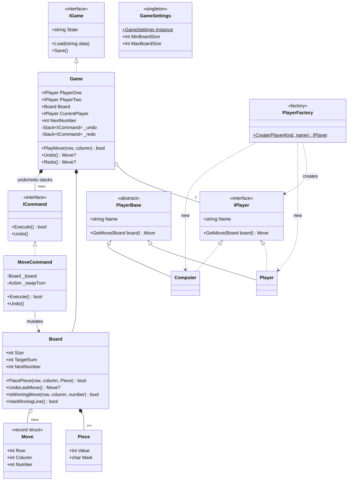
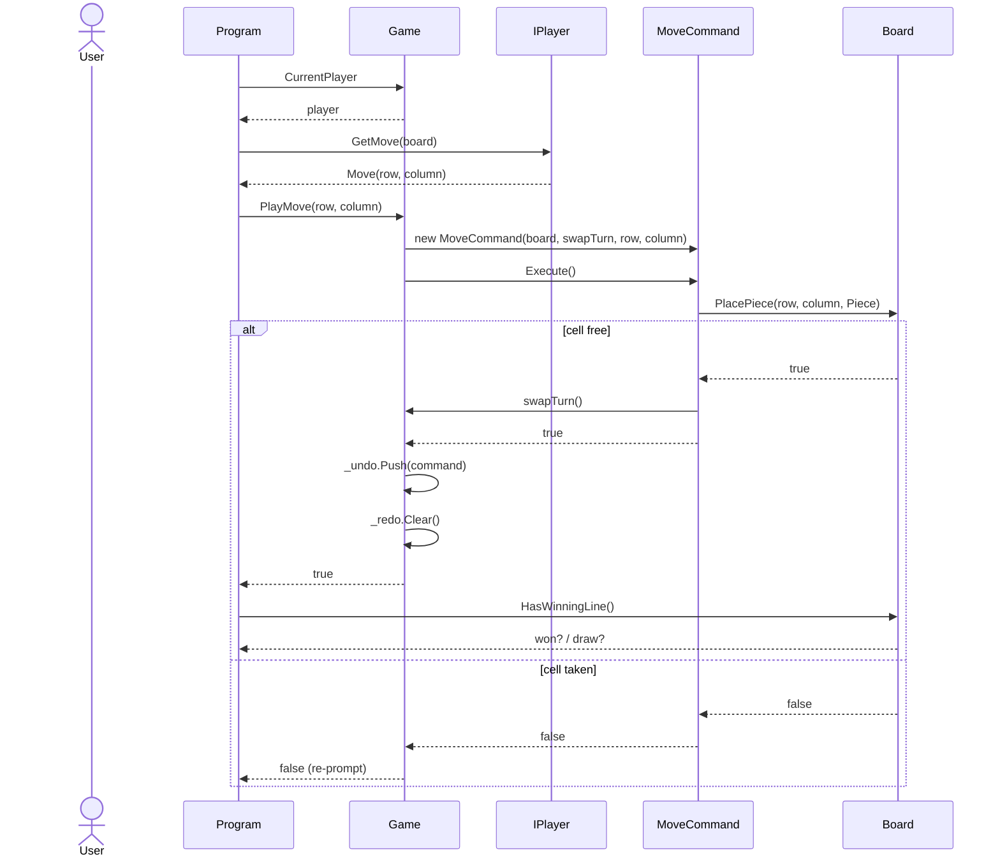

# IFQ584 — Object-Oriented Design and Development

[](https://github.com/bitcoinbrisbane/IFQ584-Object-Oriented-Design-and-Development/actions/workflows/build.yml)

Coursework for QUT unit **IFQ584 (Object-Oriented Design and Development)**: a
C# / .NET console implementation of **Numerical Tic Tac Toe**, delivered across
two assignments.

- **`Assignment1/`** — the base game and its object-oriented design (`Design.md`,
  `Design.excalidraw`).
- **`Assignment2/`** — the game extended with three Gang-of-Four design patterns,
  plus the written report (`Report.md`, `Design.pdf`).

## The game

Numerical Tic Tac Toe is played on an *n×n* board (3 ≤ *n* ≤ 9). Instead of X and
O, players share the numbers **1 … n²**: they are placed in order, and a line
(row, column, or diagonal) wins when its numbers sum to the board's **magic
constant** *n(n² + 1) / 2*. It supports human-vs-human and human-vs-computer,
undo/redo of moves, and save/load.

## Assignment requirements

Summarised from the Assignment 2 brief (see `Assignment2/Report.md` for the full
statement of completion and submission rules):

| # | Requirement |
|---|-------------|
| 1 | Numerical Tic Tac Toe core gameplay (*n×n*, shared 1…n², magic-constant win) |
| 2 | Human vs human |
| 3 | Human vs computer |
| 4 | Save / load game (JSON) |
| 5 | Undo / redo of moves |
| 6 | **Factory** pattern applied |
| 7 | **Singleton** pattern applied |
| 8 | **Command** pattern applied |

Submission is a single PDF (≤ 12 pages, A4, 2 cm margins) including the team
member list, per-member declaration of contributions, and a statement of
completion.

## Design patterns

Three Gang-of-Four patterns are applied where they genuinely fit, rather than
forced onto classes that don't want them.

### Command — `ICommand`, `MoveCommand`

Encapsulates each move as an object that knows how to both carry itself out and
reverse itself. `Game` keeps undo/redo stacks of `ICommand` instead of raw move
data, so "play", "undo" and "redo" become uniform push/pop operations and the
game loop never special-cases each action.

```csharp
public interface ICommand
{
    bool Execute();  // returns false if the move can't apply (cell taken)
    void Undo();     // restores the exact prior state
}
```

`MoveCommand` fixes the number played at construction time (the board's *next*
number then), so a later **redo** replays the identical move. This is the
strongest fit of the three: undo/redo inherently implies a command history.

### Singleton — `GameSettings`

Exactly one process-wide configuration object, reached through
`GameSettings.Instance`, holding the board-size bounds and default player names.
There is no meaningful "second instance" — two different sets of board bounds in
one run would be a bug, not a feature — which is what makes this a legitimate
singleton rather than a global variable in disguise.

```csharp
public sealed class GameSettings
{
    public static GameSettings Instance { get; } = new GameSettings();
    private GameSettings() { }   // nothing else can construct one
    // MinBoardSize, MaxBoardSize, default names…
}
```

The instance is created lazily and once by the static initialiser; the console
app is single-threaded, so no locking is needed.

### Factory — `PlayerFactory`

Centralises player creation: the game loop asks for a player by `PlayerKind` and
name and gets back an `IPlayer`, without naming the concrete `Player` or
`Computer` types. Adding a new kind of player (e.g. a networked or smarter AI
opponent) is a one-place change, and callers stay decoupled from how players are
built.

```csharp
public static IPlayer Create(PlayerKind kind, string name) => kind switch
{
    PlayerKind.Human    => new Player(name),
    PlayerKind.Computer => new Computer(name),
    _ => throw new ArgumentOutOfRangeException(nameof(kind), kind, "Unknown player kind.")
};
```

## Class diagram (Assignment 2)



## Sequence diagram (Assignment 2)

A player's move, routed through the **Command** pattern so it can later be undone.
`Program` asks the current player for a cell, `Game` wraps it in a `MoveCommand`,
executes it, and pushes it onto the undo history.



## Build and run

Requires the .NET 10 SDK.

```bash
# Assignment 2 (latest)
dotnet run --project Assignment2/TicTacToe

# Assignment 1
dotnet run --project Assignment1/TicTacToe
```

## Lines of code

Hand-written C# source (excludes `bin/` and `obj/` build output):

| Assignment | Lines |
|------------|------:|
| Assignment 1 | 757 |
| Assignment 2 | 1342 |
| **Total** | **2099** |

Regenerate the counts with the bundled script:

```bash
./count-lines.sh
```

It searches the repo for `.cs` files (skipping build output) and prints a
per-assignment breakdown and total.

## Repository layout

```
Assignment1/
  TicTacToe/            base game (Board, Game, Player, Computer, Piece…)
  Design.md, Design.excalidraw
Assignment2/
  TicTacToe/            game + patterns (ICommand, MoveCommand, GameSettings, PlayerFactory…)
  Report.md, Design.md, Design.pdf
count-lines.sh          counts C# source lines per assignment
```

---

*QUT IFQ584 coursework — Lucas Cullen (n7641052).*
